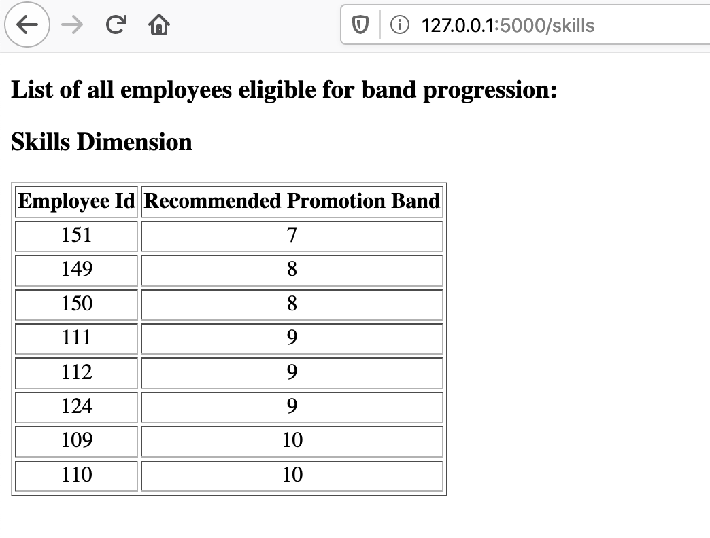
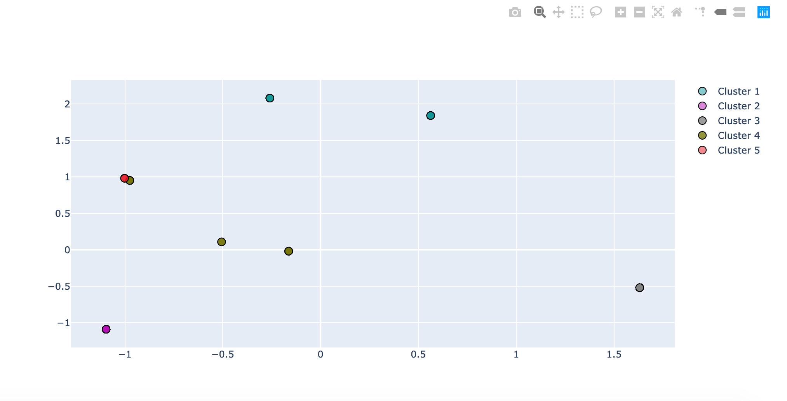

# predict-band-progression

IBM assessment tool evaluates an employee across 5 dimensions like Business, Skills, Innvovation, Customer, and Responsibility to others. Here, we have evaluated an employee across Business, Innovation and Skills dimension and recommend band progression for employees based on evaluation. The tool looks at a higher band employee as a role model and it starts clustering the results. When the Machine Learning(ML) K-means clustering algorithm clusters the dataset, we will end up with 5 clusters for 5 bands like Band 10, Band 9, Band 8, Band 7, Band 6. When a lower level employee falls in to each of the higher bands that is above than his current band, then we recommend band progression for him. It is purely based on the work he has performed for the whole year.      

This application is a recommendation engine that helps a manager to find where their employees are placed across various dimensions. If an employee is eligible for progression then the flask based python web application can indicate where the employee stand for the checkpoint dimension.     

In this hypothetical example, we have a dataset of 70 employees. The data is collected from github, JIRA, and other IBM internal tools to capture the work that he has performed. The collected data is normalised to plot and predict the results according to the requirements of machine learning algorithm. We have categorized data for different levels of employees based on their work load. In every dataset, you can find the various types of assessment in Sheet 1. Sheet 2 contains the employees and the various assessment types, they have worked.   

The machine learning model is based on K-means* Data Clustering and Decision Tree* of Data mining method. The methods can be  used by an organization to evaluate and predict the band progression of employees. 

*K-means clustering algorithm is a data mining and machine learning tool used to cluster observations into groups of related observations without any prior knowledge of those relationships.
*Decision Tree - the most powerful and popular tool for classification and prediction. 

Machine learning model is using K-means clustering algorithm to cluster the work done by all employees. We have created 5 clusters for 5 bands like Band 10, Band 9, Band 8, Band 7, Band 6. The decision tree algorithm gets employees from each of the cluster, and predicts whether an employee is eligible for band progression or not. In each of the cluster, we fetch the highest band and check whether other employees in the cluster have the experience to get promoted to the next band. Say, if an employee id 110 whose current band is 9 and he is clustered along with other employees whose band is 10, then it means that he is performing the job of band 10. The decision tree algorithm is trained with dataset SampleProgressionData.xlsx where we fed all the combinations where an employee is eligible for progression. Based on the training data, Decision Tree Algorithm predicts whether an employee is eligible for band progression or not.   

The application is deployed and running in cloud:    
https://predict-band-progression-wise-ardvark.mybluemix.net/    

Please read steps below to push the app to cloud.    

#### Business organization - dataset : 70 samples  

2 - higher Band 10 (Role models), Employee ID : 199, 200  

10 - Band 9s - Employee ID: 101-110, (110 is eligible for Progression)   

20 - Band 8s - Employee ID: 111-130, (111, 112 are eligible for Progression)    

20 - Band 7s - Employee ID: 131-150, (149, 150 are eligible for Progression)   

18 - Band 6s - Employee ID: 151-168, (151, 152 are eligible for Progression)  

The dataset is fetched from **IBM Cloud Object Storage** for the application that is running in Cloud.   

#### Following are the team members who have contributed to this project:  

Malarvizhi Kandasamy, Team lead, IBM (k.malarvizhi@in.ibm.com)  
Prasad Krishnegowda, Software Engineer, IBM (pkrishn1@in.ibm.com)  
Pinky Bhargava, Software Engineer, IBM (pinky.bhargava@in.ibm.com)  
Sakthi Saravanan Shanmugam, Software Engineer, IBM (sakshan1@in.ibm.com)  

#### Steps to run the application:
1. Git clone the application.  
2. Install python3.   
3. Setup a new Virtual Environment:    
   > python3 -m venv env  
Malars-MacBook-Pro-2:predict-band-progression malark$ python3 -m venv env  
4. Activate the virtual environment.    
   > source env/bin/activate   
Malars-MacBook-Pro-2:predict-band-progression malark$ source env/bin/activate  
(env) Malars-MacBook-Pro-2:predict-band-progression malark$ which python  

5. Install the requirements.txt.   
   > pip3 install -r requirements.txt  

6. Run the application as below:  
    > python3 flask_main.py  

 You will get the ouput as below:  
 * Serving Flask app "flask_main" (lazy loading)  
 * Environment: production  
   WARNING: This is a development server. Do not use it in a production deployment.  
   Use a production WSGI server instead.  
 * Debug mode: off  
 * Running on http://127.0.0.1:5000/ (Press CTRL+C to quit)  
  
4. Enter http://127.0.0.1:5000/  in browser:    

   Following are the endpoints of this application:

   a) Finding band progression for a particular employee:    
      http://127.0.0.1:5000/find_progression/110    
      

    
   b) Finding band progression results of all employees:      
      http://127.0.0.1:5000/   
      
      
   c) Finding band progression results for Business dimension of all employees:   
      http://127.0.0.1:5000/business    
     
     
   d) Finding band progression results for Skills dimension of all employees:   
      http://127.0.0.1:5000/skills  
      
    
   e) Finding band progression results for Innovation dimension of all employees:   
      http://127.0.0.1:5000/innovation  
      
      
#### Steps to run the application in python notebook

The application can be run as a Jupyter notebook as well. Enter below command in your command prompt or in Watson Studio, open this notebook.  

    > jupyter notebook Employee clustering.ipynb    
    
 

 Here, you can find the k-means clustering plot for 5 clusters as below:   
  

#### Steps to push the application to IBM Cloud

The cloud foundry application is connected to IBM Cloud Object Storage where the dataset for different dimension is stored. 

1. Login to IBM Cloud.  
   > ibmcloud login --sso

2. Setup the target CF and resource groups.  
   > ibmcloud target --cf  
   
  Malars-MacBook-Pro-2:predict-band-progression malark$ ibmcloud target --cf  
  Targeted Cloud Foundry (https://api.us-south.cf.cloud.ibm.com)  
  
  Targeted org k.malarvizhi@in.ibm.com  

  Targeted space dev  

                      
  API endpoint:      https://cloud.ibm.com     
  Region:            us-south     
  User:              K.MALARVIZHI@IN.IBM.COM     
  
 3. Setup the target resource groups. 
 
   > ibmcloud target -g default  
   
Targeted resource group default  

                      
API endpoint:      https://cloud.ibm.com     
Region:            us-south     
User:              K.MALARVIZHI@IN.IBM.COM     

4. Push the application to ibmcloud.      
   > ibmcloud cf push  
   
  (env) Malars-MacBook-Pro-2:predict-band-progression malark$ ibmcloud cf push   
  
Invoking 'cf push'...

Pushing from manifest to org k.malarvizhi@in.ibm.com / space dev as k.malarvizhi@in.ibm.com...  
Using manifest file /Users/malark/content/predict-band-progression/manifest.yml  
Getting app info...  
Updating app with these attributes...  
  name:                predict-band-progression  
  path:                /Users/malark/content/predict-band-progression  
  disk quota:          1G  
  health check type:   port  
  instances:           1  
  memory:              256M  
  stack:               cflinuxfs3  
  routes:  
    predict-band-progression-wise-ardvark.mybluemix.net  

Updating app predict-band-progression...  

5. Check the logs for any issues:  
   > ibmcloud cf logs predict-band-progression --recent     
    2020-03-18T10:20:42.13+0530 [APP/PROC/WEB/0] OUT  * Serving Flask app "flask_cloud" (lazy loading)  
   2020-03-18T10:20:42.13+0530 [APP/PROC/WEB/0] OUT  * Environment: production  
   2020-03-18T10:20:42.13+0530 [APP/PROC/WEB/0] OUT    WARNING: This is a development server. Do not use it in a production deployment.  
   2020-03-18T10:20:42.13+0530 [APP/PROC/WEB/0] OUT    Use a production WSGI server instead.  
   2020-03-18T10:20:42.13+0530 [APP/PROC/WEB/0] OUT  * Debug mode: on  
   2020-03-18T10:20:42.14+0530 [APP/PROC/WEB/0] ERR  * Running on http://0.0.0.0:8080/ (Press CTRL+C to quit)  
   2020-03-18T10:20:42.14+0530 [APP/PROC/WEB/0] ERR  * Restarting with stat  
   2020-03-18T10:20:43.61+0530 [APP/PROC/WEB/0] ERR  * Debugger is active!  
   2020-03-18T10:20:43.80+0530 [APP/PROC/WEB/0] ERR  * Debugger PIN: 166-049-110  
   2020-03-18T10:20:43.93+0530 [CELL/0] OUT Container became healthy  

(env) Malars-MacBook-Pro-2:predict-band-progression malark$ ibmcloud cf logs predict-band-progression --recent   

6. List all apps deployed in cloud:    
(env) Malars-MacBook-Pro-2:predict-band-progression malark$ ibmcloud cf apps  
Invoking 'cf apps'...  

Getting apps in org k.malarvizhi@in.ibm.com / space dev as k.malarvizhi@in.ibm.com...  
OK    

name                       requested state   instances   memory   disk   urls  
predict-band-progression   started           1/1         256M     1G     predict-band-progression-wise-ardvark.mybluemix.net  

